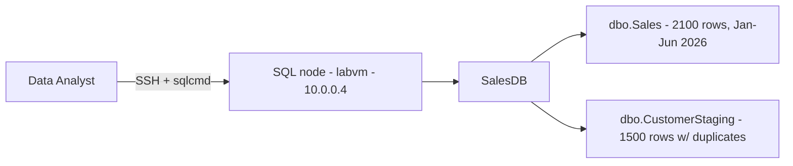

# SQL — Data Analysis Queries (Lab 01)

Welcome to your SQL data-analysis hands-on skills assessment. This environment gives you **one live SQL Server 2022 on Linux** node (Ubuntu 22.04) preloaded with an analytics database. Read this page, then move to **Exercise 1** to begin.

### Overall Estimated timing: 120 Minutes

## Overview

In this assessment you act as a **Data Analyst** for a sales platform running on SQL Server. The business needs three analytical results delivered as **reusable views** over the `SalesDB` database: a monthly **sales trend**, a **de-duplicated customer list**, and a **conditional-aggregation breakdown** of sales by status. You will write the T-SQL yourself and publish each result as a named view. You are graded on the **state of the live SQL Server instance** — specifically, on the views you create and the values they return.

## Objectives

By the end of this assessment you will have:

1. **Aggregated revenue into a sales trend** by month and published it as the view `dbo.vw_SalesTrend`.
2. **Removed duplicate rows with ranking functions** (`ROW_NUMBER()` / `RANK()`), keeping the latest row per customer, and published it as the view `dbo.vw_DedupedCustomers`.
3. **Built a conditional aggregation** (`SUM(CASE WHEN …)`) that breaks sales down by status, and published it as the view `dbo.vw_SalesByStatus`.

## Pre-requisites

Working knowledge of MS SQL Server and **T-SQL**: aggregate functions and `GROUP BY`; date functions for grouping by period; **window/ranking functions** (`ROW_NUMBER()`, `RANK()`, `PARTITION BY`); conditional aggregation with `SUM(CASE WHEN …)`; and creating **views** (`CREATE VIEW`). Comfort connecting to SQL Server with `sqlcmd` over SSH.

## Architecture

A single Ubuntu 22.04 node runs SQL Server 2022 for Linux. You connect to it over SSH and use `sqlcmd`. The node hosts `SalesDB`, which the bootstrap has seeded with two tables — `dbo.Sales` (sales transactions) and `dbo.CustomerStaging` (a customer load table that intentionally contains duplicates).

## Getting Started with the lab

Your virtual machine and this **Guide** are available within your web browser. Use the **Split Window** button at the top-right to open the guide beside your terminal.

## Accessing Your Lab Environment

1. Connect to the SQL node over SSH using the details on the **Environment** tab.

    - **SSH command:** see the **LABVM SSH Command** output on the **Environment** tab
    - **Username:** see the **LABVM Admin Username** output on the **Environment** tab
    - **Password:** see the **LABVM Admin Password** output on the **Environment** tab

1. Connect to SQL Server with `sqlcmd` using the **SA** login. The sample password is **`NedSQL@1234!`** (also recorded in `/home/labuser/README.txt`):

    - `/opt/mssql-tools/bin/sqlcmd -S localhost -U SA -P 'NedSQL@1234!' -d SalesDB`
    - or `/opt/mssql-tools18/bin/sqlcmd -C -S localhost -U SA -P 'NedSQL@1234!' -d SalesDB` (the `-C` trusts the self-signed server certificate)

1. Your environment id for this run is **<inject key="DeploymentID" enableCopy="false"/>** — quote it if you contact support.

### Environment Details

- **One Ubuntu 22.04 SQL Server 2022 on Linux node** (`Standard_D2s_v3`): `labvm-<DeploymentID>`, private IP `10.0.0.4`.
- The **`SalesDB`** database contains **`dbo.Sales`** (2,100 rows dated Jan–Jun 2026 with an `Amount`, `Region`, `Category`, and `Status`) and **`dbo.CustomerStaging`** (1,500 rows that deliberately repeat the same `CustomerId` with different `LoadDate` values).
- No object you need to create yet exists — each exercise asks you to publish a specific **view**.

## Track Your Progress

Use the **Validate** button on each task to check your work. The **Progress** tab shows your validation score; it reaches 100% when all task validations pass.

## Lab Duration Extension

You have **120 minutes** for this assessment. If you need more time, click the **Hourglass** icon in the top-right of the lab environment (it appears when 10 minutes remain) and click **OK**.

## Support Contact

The CloudLabs support team is available 24/7 via email and live chat.

- Email Support: labs-support@spektrasystems.com
- Live Chat Support: https://cloudlabs.ai/labs-support

Click **Next** to begin Exercise 1.

## Happy Assessing !!
